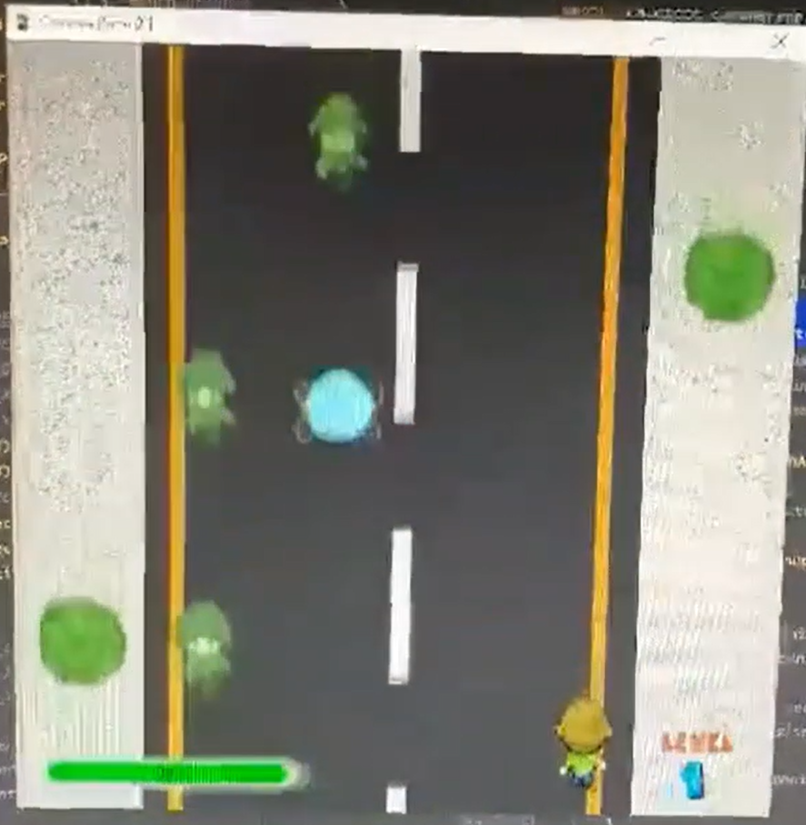
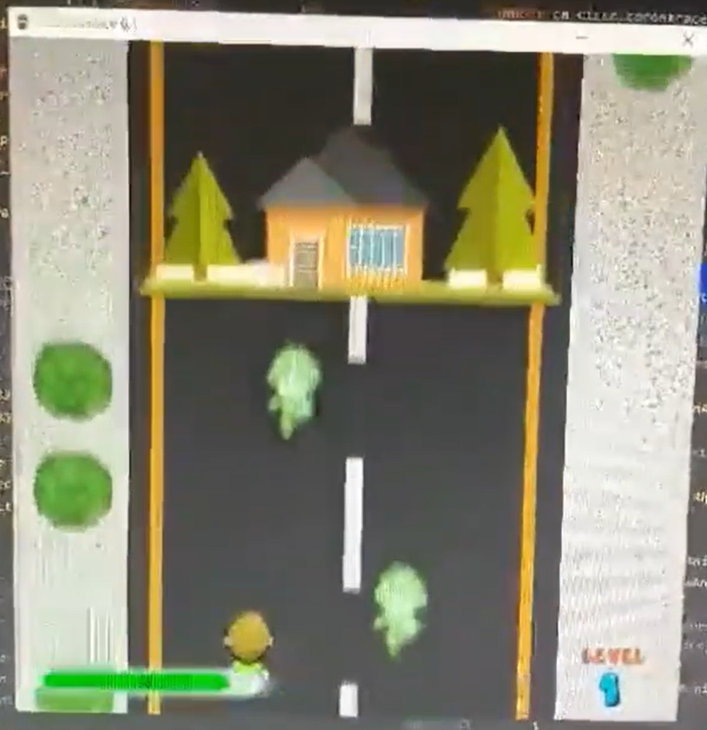
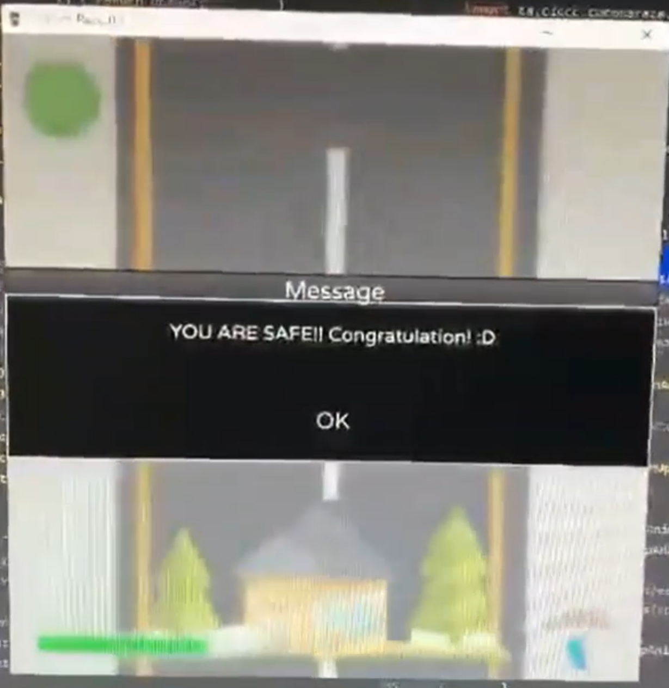

# 🕹️ CoronaRace

## 🧭 Overview
**CoronaRace** is a 2D arcade-style game built using **Java** and **JavaFX SDK 18** as a final project for the Web and Mobile Application Development diploma at CICCC. The game simulates a character racing against time and viruses during the height of the COVID-19 pandemic. The project was developed collaboratively by a team of three classmates.

The objective is to avoid virus obstacles and collect face masks to maintain your health bar and reach the finish line.

### Enemies and health items


### Final line


### Finish



## 💡 Idea & Concept
CoronaRace was inspired by the global COVID-19 pandemic and gamifies the challenge of surviving during a viral outbreak. The concept evolved into a fun and educational game with:
- Health management and strategy
- Fast-paced mechanics
- Playful social commentary on protective gear like face masks

## ✨ Features & Functionality
- 🧍 Character runs on a 3-lane path
- 😷 Collectible face masks restore health
- 🦠 Avoid viruses to prevent losing life
- 📉 Health bar and damage logic
- 🔁 Random object placement engine
- 🎮 Win/loss conditions based on health and finish line
- 🔊 Custom sound effects and animated sprites

## ⚙️ Tech Stack
| Category             | Tools & Frameworks |
|----------------------|--------------------|
| **Language**         |  |
| **Framework**        |  |
| **IDE**              |  |
| **Version Control**  |   |

## 🏗 Architecture & Design
- Game loop using JavaFX animation
- Modular controller-based design for player input and object spawning
- Sprite and texture management using JavaFX media API
- Collision detection and health logic implemented with object bounds

## 🚀 Installation & Setup
- **Prerequisites:** Java 11+ and JavaFX SDK
- **Run Instructions:**
  ```bash
  git clone [repo-url]
  cd coronarace
  ./gradlew run
  ```
- No database or server setup required

> **Note:** Assets (images/sounds) are stored locally and mapped to sprite layers.

## 🧑‍💻 My Role & Contributions
- 💼 Designed game logic, random object generator, and scoring system
- 🎨 Created custom textures and UI elements
- 🧠 Built movement, collision, and animation logic
- 🤝 Led GitHub collaboration and bug tracking

## 🧗 Challenges & Learnings
- First game developed using JavaFX from scratch
- Learned sprite management and timing in Java
- Improved collaboration in small agile team
- Balanced performance and responsiveness without a physics engine

## 📈 Future Enhancements
- Add level progression and boss stages
- Improve UI and visual effects
- Deploy as mobile game or WebAssembly build
- Add global leaderboard and score tracking

## 🪪 License
Educational project – not licensed for commercial use
